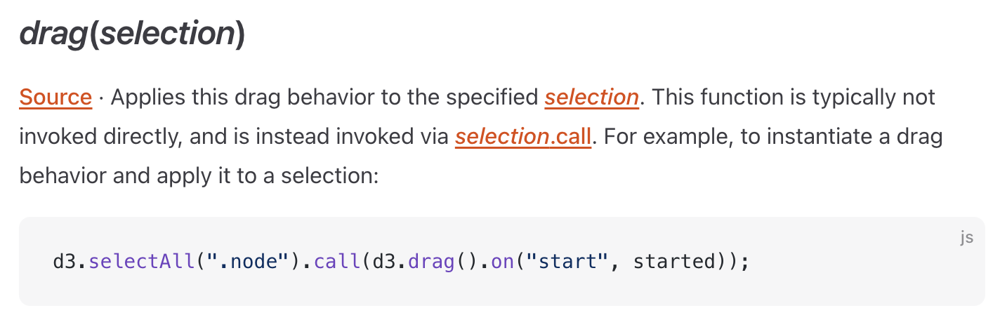
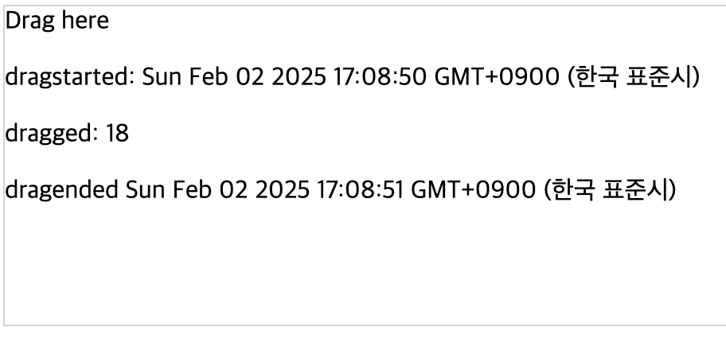

# 드래그
### 드래그를 위한 d3.call
아래 코드를 이해해보자.
```js
var div = d3.selectAll("div")
    .call(
        d3.drag()
        .on("start", dragstarted)
        .on("drag", dragged)
        .on("end", dragended)
    );
const divMsg = div.append("p");

var dragged
var draggedCount = 0;

// 드래그 시작 호출되는 함수
function dragstarted() {
    divMsg.text("");
    divMsg.append("p").text("dragstarted: " + new Date());
    dragged = divMsg.append("p");
    draggedCount = 0;
}

// 드래그하는 동안 호출되는 함수
function dragged() {
    dragged.text("dragged: " + (draggedCount++));
}

// 드래그 종료시 호출되는 함수
function dragended() {
    divMsg.append("p").text("dragended  " + new Date());
    dragging = false;

    // d3.selectAll("div")
    //     .on(".drag", null);
}
```

일단 아래 부분을 보자.

```js
var div = d3.selectAll("div")
    .call(
        d3.drag()
        .on("start", dragstarted)
        .on("drag", dragged)
        .on("end", dragended)
    );
```

```call()```은 현재 **선택된 요소에 함수를 적용할 때** 사용합니다.

❓**왜 ```call(d3.drag())```을 써야 할까?**

D3에서 요소를 드래그 가능하게 만들려면 ```d3.drag()```를 적용해야 합니다. 하지만 ```d3.drag()``` 자체는 드래그 이벤트를 정의하는 함수일 뿐, 요소에 바로 적용되지는 않습니다.

그래서 ```.call(d3.drag())```을 사용하여 circle 요소가 드래그 이벤트를 감지하도록 만듭니다.

공식문서에 보면 다음과 같이 써있다.


즉, drag behavior를 특정 selection된 것에 적용할 때, 이 함수 drag는 바로 실행되지는 않기 때문에 selection.call을 통해 드래그가 실행될 수 있다는 것.

**📌 ```on()``` 메서드는 언제, 왜 쓰는 걸까?**

D3.js에서 ```.on()```은 이벤트 리스너를 추가할 때 사용됩니다.
즉, 특정 이벤트(클릭, 마우스오버, 드래그 등)가 발생했을 때 실행할 동작을 정의할 수 있습니다. on의 기본 문법 : 

```js
d3.select("circle")
  .on("event", function(event, d) {
    // 이벤트 발생 시 실행할 코드
  });
```
- ```"event"```: 이벤트 이름 (예: "click", "mouseover", "drag", etc.)
- ```event```: 이벤트 객체 (마우스 좌표, 키 입력 등)
- ```d```: 해당 요소의 데이터

예제 : 마우스를 올리면 색상 변경
```js
d3.select("circle")
  .on("mouseover", function () {
    d3.select(this).attr("fill", "red");
  })
  .on("mouseout", function () {
    d3.select(this).attr("fill", "blue");
  });
```
- mouseover: 마우스를 올리면 색이 빨간색으로 변함.
- mouseout: 마우스를 치우면 색이 파란색으로 돌아감.

난 초보니까 listener라는 개념을 보자.

> **listener 개념**
> 
> 👉 이벤트 리스너(listener)는 특정 이벤트(클릭, 드래그, 키 입력 등)가 발생했을 때 실행되는 함수(콜백 함수)를 의미해.
> 즉, listener는 "어떤 이벤트가 발생하면 실행할 코드"를 담고 있는 함수.
>
> listener가 어떻게 동작하는지 예제
> ```js
> document.getElementById("myButton").> addEventListener("click", function() {
>   alert("버튼이 클릭됨!");
> });
> ```
> - ```"click"```: 이벤트 유형 (버튼이 클릭될 때)
>   - ```"click"```등은 이미 정의되어 있으며, '이벤트 타입'이라고 부른다.
>   - ```"mousedown"``` : "마우스 버튼을 누를 때" 등이 있다.
> - ```function() {...}```: 이 이벤트가 발생하면 실행될 리스너 함수
> - ```"click"``` 같은 이벤트가 발생하면 브라우저가 감지하고, 지정된 함수를 실행

---

### dragstarted() 함수

```js
const divMsg = div.append("p");
var dragged
var draggedCount = 0;

// 드래그 시작 호출되는 함수
function dragstarted() {
    divMsg.text("");
    divMsg.append("p").text("dragstarted: " + new Date());
    dragged = divMsg.append("p");
    draggedCount = 0;
}

// 드래그하는 동안 호출되는 함수
function dragged() {
    dragged.text("dragged: " + (draggedCount++));
}
```

- ```div.append("p")``` → 요소를 추가해서 divMsg에 저장.
- ```divMsg.text("")``` → 기존 내용을 지움. 드래그가 시작할 때마다 divMsg가 가리키는 요소 안의 기존 텍스트를 삭제.
- ```divMsg.append("p").text("dragstarted: " + new Date())``` → 드래그가 시작될 때 시간 정보 표시. 새로운 요소를 추가해서 "dragstarted: 현재 시간"을 표시

- ```dragged = divMsg.append("p")```→ 새로운 요소를 하나 추가하고, 이걸 dragged 변수에 저장. 이 요소는 드래그 중(dragged() 함수에서) 변경될 예정
- ```dragged.text("dragged: " + (draggedCount++));```→ 드래그할 때 숫자가 증가하면서 업데이트됨.


## 이제 아래 코드에서 .container, .subject, beginPath, event, event.subject, fx와 fx 등에 대해 알아보자.

```js
d3.select(canvas)
  .call(d3.drag()
  .container(canvas)
  .subject(dragsubject)
  .on("start", dragstarted)
  .on("drag", dragged)
  .on("end", dragended));

function dragsubject(event) {
  return simulation.find(event.x, event.y, radius)
}

function dragstarted(event) {
  if (!event.active) {
    simulation.alphaTarget(0.3).restart()
  }
  event.subject.fx = event.subject.x;
  event.subject.fy = event.subject.y
}

function dragged(event) {
  event.subject.fx = event.x;
  event.subject.fy = event.y
}

function dragended() {
  if (!event.active) {
    simulation.alphaTarget(0)
  }

  event.subject.fx = null;
  event.subject.fy = null
}
```

**1️⃣ .call(d3.drag()... )**

```js
d3.select(canvas)
    .call(d3.drag()
        .container(canvas)
        .subject(dragsubject)
        .on("start", dragstarted)
        .on("drag", dragged)
        .on("end", dragended)
    );
```

**📌 무슨 역할을 할까?**

- ```d3.select(canvas).call(d3.drag()...)```
→ 캔버스에서 드래그 이벤트를 활성화함.
- ```.container(canvas)```
→ 드래그가 가능한 영역을 설정. (여기서는 canvas 전체)
- ```.subject(dragsubject)```
→ 드래그할 대상을 찾는 역할 (어떤 원(circle)을 드래그할 건지 결정)
- ```.on("start", dragstarted)```
→ 드래그 시작할 때 실행할 함수
- ```.on("drag", dragged)```
→ 드래그하는 동안 실행할 함수
- ```.on("end", dragended)```
→ 드래그가 끝나면 실행할 함수

**2️⃣ .container(canvas)**

```js
d3.drag()
    .container(canvas)
```
📌 이건 뭘까?
- ```container()```는 드래그할 수 있는 범위를 지정하는 옵션.
- 여기서는 `canvas` 전체에서 드래그할 수 있도록 설정한 것.

✅ 언제 쓰는지?

- 특정 영역(예: div, svg) 내에서만 드래그를 제한하고 싶을 때.
- 기본적으로는 ```.container(canvas)```를 생략해도 되지만,
여러 개의 캔버스가 있을 경우 어떤 캔버스에서 드래그할지를 명확하게 지정하는 용도로 사용됨.


**3️⃣ .subject(dragsubject)**

```js
.subject(dragsubject)
```

📌 이건 뭘까?

subject()는 드래그할 대상을 결정하는 함수야.

지금 코드를 보면, dragsubject라는 함수를 사용하고 있어.

📌 dragsubject 함수 분석

```js
function dragsubject(event) {
    return simulation.find(event.x, event.y, radius)
}
```

✅ ```simulation.find(x, y, radius)``` → (x, y) 좌표 기준으로 반지름 radius 내에 있는 원을 찾음.

✅ 즉, 사용자가 클릭한 지점 근처에 있는 원을 찾아서 그 원을 드래그 대상으로 설정하는 역할을 함.

🔹 왜 필요할까?

→ 사용자가 여러 개의 원 중 하나를 클릭했을 때, 클릭한 위치에서 가장 가까운 원을 자동으로 찾기 위해!

**4️⃣ event 객체**
```js
function dragstarted(event) { ... }
function dragged(event) { ... }
function dragended(event) { ... }
```

📌 event란 뭘까?

- event는 D3에서 자동으로 제공하는 이벤트 객체.
- 사용자가 마우스를 클릭하거나 드래그할 때 현재 이벤트의 정보(x, y 좌표 등)를 담고 있음.

✅ 이벤트 객체에 포함된 중요한 정보들

- ```event.x```	 : 사용자가 드래그하는 동안 마우스의 X 좌표
- ```event.y```	사용자가 드래그하는 동안 마우스의 Y 좌표
- ```event.subject```	현재 드래그되고 있는 원(circle) 객체

**5️⃣ `event.subject.fx`와 `event.subject.fy`**

```js
function dragstarted(event) {
    if (!event.active) {
        simulation.alphaTarget(0.3).restart()
    }
    event.subject.fx = event.subject.x;
    event.subject.fy = event.subject.y;
}
```

📌 왜 ```fx```, ```fy```를 사용하지?

- `fx`와 `fy`는 D3의 `forceSimulation`에서 강제로 위치를 고정하는 역할을 하는 속성.
- 원래 D3의 힘 기반 시뮬레이션(`forceSimulation`)에서는 원들이 자동으로 힘을 받아서 움직임.
- 하지만 사용자가 드래그하는 동안 다른 힘의 영향을 받지 않고 사용자가 이동시키는 대로 움직이게 해야함.
- 그래서 드래그하는 동안에는 `fx`, `fy`를 `event.x`, `event.y`로 고정해 주는 것.

✅ 비교: `x`, `y` vs. `fx`, `fy`

- `x`, `y` : 원래 D3의 시뮬레이션이 관리하는 위치 (외부 힘의 영향을 받음)
- `fx`, `fy` : 사용자가 강제로 지정한 위치 (고정됨)

📌 왜 드래그 끝나면 fx, fy를 null로 만들까?

```js
function dragended(event) {
    if (!event.active) {
        simulation.alphaTarget(0)
    }
    event.subject.fx = null;
    event.subject.fy = null;
}
```

- 드래그가 끝나면 원래의 물리적 시뮬레이션으로 돌아가도록 해야함!
- `fx`, `fy`를 `null`로 설정하면 다시 자연스럽게 움직이게 됨.

**6️⃣ beginPath()에서 path란?**

```js
function drawCircles() {
    context.clearRect(0, 0, width, height);
    context.save();
    context.beginPath();
    circles.forEach(drawCircle);
    context.fill();
    context.strokeStyle = "Gold";
    context.stroke();
}
```

📌 `beginPath()`는 뭐야?

- 새로운 그림을 그리기 전에 기존의 선(`path`)을 초기화하는 역할을 함.
- 캔버스(`canvas`)에서 원을 그릴 때, 이전에 그려진 것들이 남아 있으면 겹쳐질 수 있음.
- `beginPath()`를 사용하면 새로운 그림을 그릴 준비를 한다고 생각하면 됨!

✅ 비유하자면?

→ `beginPath()`는 **"새로운 도화지에 그림을 그리기 전에 연필을 드는 것"**.
→ `context.arc()`로 원을 그린 후, `stroke()`로 테두리를 그리고, `fill()`로 색을 채움.