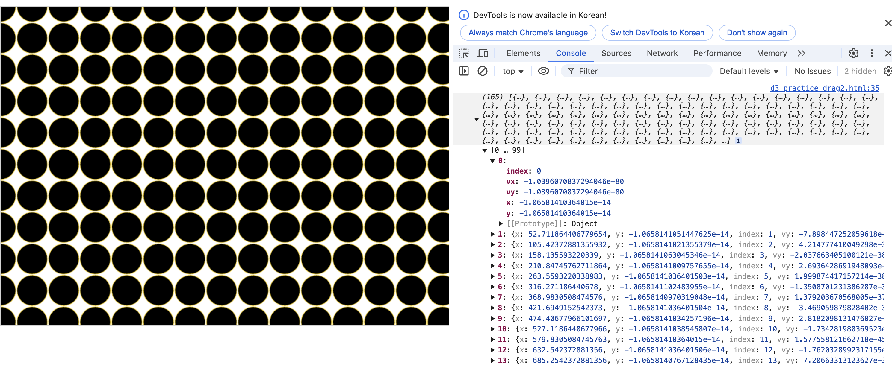

# Drag 2

## 아래 코드를 이해해보자.

소스 : https://www.devkuma.com/docs/d3-js/drag/

```js
<!DOCTYPE html>
<html lang="en">

<head>
  <meta charset="UTF-8">
  <title>drag</title>
  <script src="https://d3js.org/d3.v7.min.js"></script>
</head>

<body>

  <div id="d3Graph" style="border: lightgray solid 1px;display: inline-block;width: 100%;"></div>

  <script>
    var divWidth = document.querySelector("#d3Graph").clientWidth;
    var vhWindowRatio = 420 / 590;

    document.querySelector("#d3Graph").style.height = parseInt(divWidth * vhWindowRatio) + "px";
    var divHeight = document.querySelector("#d3Graph").clientHeight;
    
    d3.select("#d3Graph").append("canvas");

    var canvas = document.querySelector("canvas");
    var context = canvas.getContext("2d");
    canvas.width = divWidth;
    canvas.height = divHeight;

    var width = canvas.width;
    var height = canvas.height;
    var rRatio = width / 590;
    var radius = 20 * rRatio;
    var circles = d3.range(165).map(function (a) {
      return { x: (a % 15) * (radius + 1) * 2, y: Math.floor(a / 15) * (radius + 1) * 2 }
    });

    var simulation = d3.forceSimulation(circles)
      .force("collide", d3.forceCollide(radius + 1)
                          .iterations(4))
      .on("tick", drawCircles);

    d3.select(canvas)
        .call(
            d3.drag().container(canvas)
            .subject(dragsubject)
            .on("start", dragstarted)
            .on("drag", dragged)
            .on("end", dragended)
            );

    function drawCircles() {
      context.clearRect(0, 0, width, height);
      context.save();
      context.beginPath();
      circles.forEach(drawCircle);

      context.fill();
      context.strokeStyle = "Gold";
      context.stroke()
    }

    function drawCircle(a) {
      context.moveTo(a.x + radius, a.y);
      context.arc(a.x, a.y, radius, 0, 2 * Math.PI)
    }

    function dragsubject(event) {
      return simulation.find(event.x, event.y, radius)
    }

    function dragstarted(event) {
      if (!event.active) {
        simulation.alphaTarget(0.3).restart()
      }
      event.subject.fx = event.subject.x;
      event.subject.fy = event.subject.y
    }

    function dragged(event) {
      event.subject.fx = event.x;
      event.subject.fy = event.y
    }

    function dragended() {
      if (!event.active) {
        simulation.alphaTarget(0)
      }

      event.subject.fx = null;
      event.subject.fy = null
    }
    
    (window.onload = function () {
      width = document.querySelector("#d3Graph").clientWidth;
      document.querySelector("#d3Graph").style.height = parseInt(width * vhWindowRatio) + "px";
      height = document.querySelector("#d3Graph").clientHeight;

      canvas.width = width;
      canvas.height = height
    });
  </script>

</body>

</html>
```

## forceSimulation

먼저 ```circles```라는 변수부터 보자.
```js
var circles = d3.range(165).map(function (a) {
    return { 
        x: (a % 15) * (radius + 1) * 2, 
        y: Math.floor(a / 15) * (radius + 1) * 2 
        }
});
```

- ```var circles = d3.range(165).map(function (a) {...``` : 165개의 원(circle) 좌표를 생성
  - ```d3.range(n)```은 0부터 n-1까지의 숫자가 들어 있는 배열을 생성. 즉, ```d3.range(165)```는 ```[0, 1, 2, ..., 164]```의 배열을 반환.
- ```.map(function (a) {...})``` : 각 원의 위치 (x, y)를 계산하는 함수
  - ```a```는 0~164까지의 숫자이고, 이를 이용해서 원의 (x, y) 좌표를 결정
  - 원 사이에 **적절한 간격(radius + 1)**을 둬서 겹치지 않도록 함


circles 변수를 찍어보면 165개의 요소가 있는 배열이며, 각 요소는 x, y 값을 갖는다.


## 그 다음 D3의 ```forceSimulation```에 대해 알아보자. 

D3의 물리 기반(force layout) 시뮬레이션을 사용해서 원(circle)들이 서로 겹치지 않도록 함. 각 원이 충돌하지 않도록 force simulation을 적용해서 자연스럽게 퍼지게 만드는 방식.

```js
var simulation = d3.forceSimulation(circles).force(
                                            "collide", 
                                            d3.forceCollide(radius + 1).iterations(4)
                                            )
                                            .on("tick", drawCircles);
```

✅ **```d3.forceSimulation(circles)```**

- D3의 force simulation(물리 엔진)을 생성하고, circles 배열을 시뮬레이션에 추가.
- circles는 원들의 초기 위치를 담은 배열이고, 시뮬레이션이 실행되면서 원들의 위치가 업데이트됨.


✅ **```.force("collide", d3.forceCollide(radius + 1).iterations(4))```**
- 원들끼리 서로 겹치지 않도록 하는 충돌(Collision) force를 추가.
- d3.forceCollide(radius + 1):
    - 각 원(circle)의 반지름 + 1(px) 만큼의 거리를 유지하면서, 서로 겹치지 않도록 함.
    - 원의 중심 간 거리가 radius + 1 이하가 되면 서로 밀어내는 효과 발생.
- ```.iterations(4)```:
  - 충돌을 더 정확하게 처리하기 위해 4번 반복하여 보정.
  - 값을 증가시키면 원들이 더 부드럽게 퍼지지만, 성능이 조금 더 느려질 수 있음.

✅ ```.on("tick", drawCircles)```
- 시뮬레이션의 각 단계(프레임)에서 drawCircles() 함수를 호출하여 원들의 위치를 계속 업데이트.
- ```"tick"``` 이벤트는 시뮬레이션이 실행될 때마다 호출됨.
- 원들이 부드럽게 움직이도록 애니메이션을 적용하는 역할.
- ```drawCircles()```은 아래쪽에 다음과 같이 정의돼있다.
```js
function drawCircles() {
    context.clearRect(0, 0, width, height);  // (1) 캔버스 초기화
    context.save();                          // (2) 현재 캔버스 상태 저장
    context.beginPath();                     // (3) 새로운 경로(Path) 시작
    circles.forEach(drawCircle);             // (4) 모든 원을 그리는 함수 실행

    context.fill();                          // (5) 원 내부를 채우기
    context.strokeStyle = "Gold";            // (6) 원의 테두리 색을 골드로 지정
    context.stroke();                        // (7) 원의 테두리를 그림
}

```

**✅ drawCircles()가 하는 일**
- context를 이용해 캔버스를 지우고, 원들을 다시 그림
- drawCircles()는 원들을 캔버스에 그리는 역할을 한다.
- 캔버스를 초기화(clearRect)하고, 모든 원을 다시 그린다.
- 테두리는 금색, 내부는 기본 색으로 채운다.
- 캔버스를 매 프레임마다 업데이트하여 드래그 등의 움직임이 반영됨.

**📌 "프레임(Frame)"이란?**

- 프레임(Frame)이란, 화면이 갱신되는 단위.
- 프레임은 한 번의 화면 업데이트를 의미함.
- 보통 **초당 프레임 수(FPS, Frames Per Second)**로 측정됨. 60FPS라면, 1초에 60번 화면이 갱신됨
- 캔버스에서 프레임마다 화면을 다시 그린다는 것은,
  - 기존의 그림을 지우고(```clearRect()```)
  - 새로운 위치에서 다시 그림(```drawCircles()```)
  - 이 과정이 반복되면서 애니메이션처럼 보이게 됨.
- 마치 동영상이 여러 장의 이미지(프레임)로 이루어진 것과 같은 원리.
- 프레임은 새로고침과 상관없이, 코드에서 반복적으로 화면을 갱신할 때 발생
- 예를 들어, 드래그를 하면 계속해서 새로운 프레임이 그려지면서 원이 움직이는 것처럼 보임

**📌 ```.on("tick", drawCircles)```에서 ```"tick"``` 이벤트는 언제 실행되는 것?**
- 새로고침(F5) 했을 때만 실행되는 게 아니다.
- "tick" 이벤트는 D3의 forceSimulation(물리 시뮬레이션)이 동작하는 동안 계속 실행되는 이벤트. **즉, 시뮬레이션이 진행되는 동안, 매 프레임마다 실행됨.**
- 시뮬레이션이 실행된다는 것 : 
  - forceSimulation()이 초기화되었을 때
  - 힘(예: force("collide"))이 적용되어 노드들이 서로 밀려나는 동안
  - alpha(시뮬레이션의 진행 정도)가 줄어들면서 움직임이 멈출 때까지
  - tick 이벤트가 매 프레임 실행됨.

**📌 ```"tick"```이 실행되는 과정 예제**
```js
var simulation = d3.forceSimulation(nodes)
    .force("collide", d3.forceCollide(radius + 1).iterations(4))
    .on("tick", drawCircles);  // ✅ 시뮬레이션이 실행될 때마다 drawCircles 호출!
```
1️⃣ 새로고침(F5)

- 전체 페이지가 다시 로드되면서 ```forceSimulation()```이 다시 시작됨.
- tick 이벤트가 실행되면서 원들이 처음 위치에서 배치됨.

2️⃣ 노드가 서로 충돌하면서 힘을 받을 때

- ```force("collide")``` 같은 힘이 적용되면, 원들이 겹치지 않도록 서로 밀어냄.
- 이 과정에서 tick이 여러 번 실행되며 원들이 움직임.

3️⃣ 노드를 드래그할 때

- ```dragged()``` 함수에서 ```fx```, ```fy``` 값을 설정하면 원의 위치가 강제로 변경됨.
- 이때 시뮬레이션이 다시 시작되며 tick이 실행됨.
- 드래그하는 동안 계속해서 새로운 위치가 계산됨.


## 다음은 아래 코드 부분을 이해해보자.
```js
var divWidth = document.querySelector("#d3Graph").clientWidth;  // HTML에서 id="d3Graph"를 가진 요소의 너비를 가져옴
var vhWindowRatio = 420 / 590;  // 고정된 비율(420px / 590px)로 높이를 계산하기 위한 변수

document.querySelector("#d3Graph").style.height = parseInt(divWidth * vhWindowRatio) + "px";  // 너비(divWidth)에 비율을 곱해 height 값을 설정
var divHeight = document.querySelector("#d3Graph").clientHeight;

d3.select("#d3Graph").append("canvas");  // D3.js를 이용해 #d3Graph 내부에 <canvas> 태그를 추가

var canvas = document.querySelector("canvas");  // 방금 추가된 <canvas> 요소를 가져옴
var context = canvas.getContext("2d");  // 캔버스의 2D 그래픽을 그릴 수 있도록 context를 가져옴(아래 4번에서 설명)
canvas.width = divWidth;
canvas.height = divHeight;  // 캔버스 크기를 divWidth, divHeight에 맞춤
```

**✅ 1. document란?**
- document는 HTML 문서 전체를 의미하는 객체.
  - ```document.body``` : <body> 태그 전체 가져오기
```html
  <body>
  <h1>Hello World</h1>
  <p id="text">This is a paragraph.</p>
</body>
```

- 위와 같은 코드에서 ```document.getElementById("text").textContent``` : "This is a paragraph."

**✅ 2. ```querySelector()```란?**

-  ```document.querySelector()```는 CSS 선택자를 이용해 특정 HTML 요소를 선택하는 메서드이다.
- 단 하나의 요소만 선택하며, 첫 번째로 일치하는 요소만 반환.

```html
<div class="box">첫 번째 박스</div>
<div class="box">두 번째 박스</div>

const box = document.querySelector(".box"); // 첫 번째 `.box` 선택
console.log(box.textContent);  // "첫 번째 박스"
```

**✅ 3. ```querySelector()``` vs ```d3.select()```의 차이점**
- ```document.querySelector()```는 자바스크립트 기본 기능, ```d3.select()```는 D3.js 라이브러리
- ```document.querySelector()```는 단일 요소 (첫 번째 일치 요소)를 반환, 	```d3.select()```는 D3.js의 선택(selection) 객체를 반환
- 이벤트 바인딩 시 ```document.querySelector()```는 	```addEventListener()``` 사용, d3.select()는 ```.on()``` 사용

**✅ 4. ```var context = canvas.getContext("2d");```**

- HTML ```<canvas>``` 태그는 그 자체로는 아무것도 안 보인다. 실제로 그 위에 그림을 그리는 역할을 하는 것이 context.
- context는 캔버스에 그리기 위한 다양한 메서드와 속성을 제공.
- canvas.getContext("2d")를 호출하면, 2D 그래픽을 그릴 수 있는 객체를 반환함.
- context를 통해 도형, 텍스트, 이미지, 애니메이션 등을 캔버스에 그릴 수 있음
- context 가져오는 방법
```js
<canvas id="myCanvas" width="500" height="300"></canvas>

const canvas = document.getElementById("myCanvas"); // 캔버스 요소 가져오기
const context = canvas.getContext("2d");  // 2D 그래픽을 그릴 수 있는 context 생성

// 사각형 그리기 (x, y, width, height)
context.fillStyle = "blue";   // 색깔 설정
context.fillRect(50, 50, 150, 100);  // 사각형 그리기
// 결과: 50, 50 위치에 너비 150px, 높이 100px인 파란색 사각형이 그려짐
```